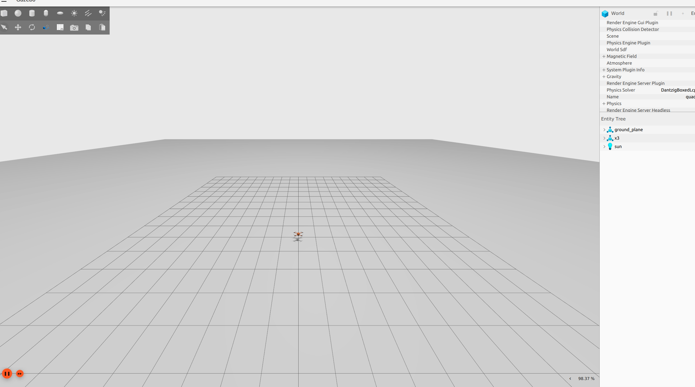
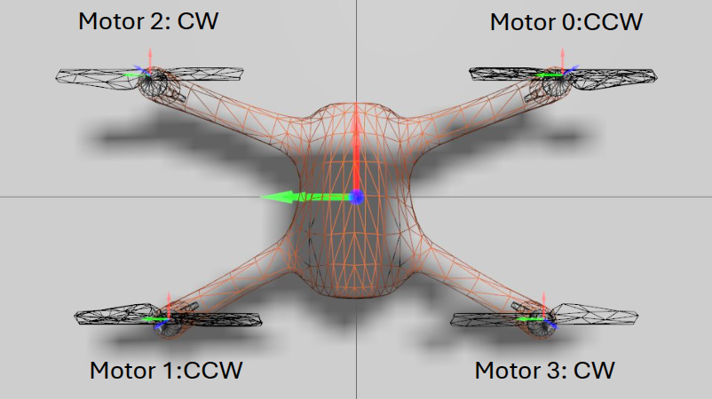
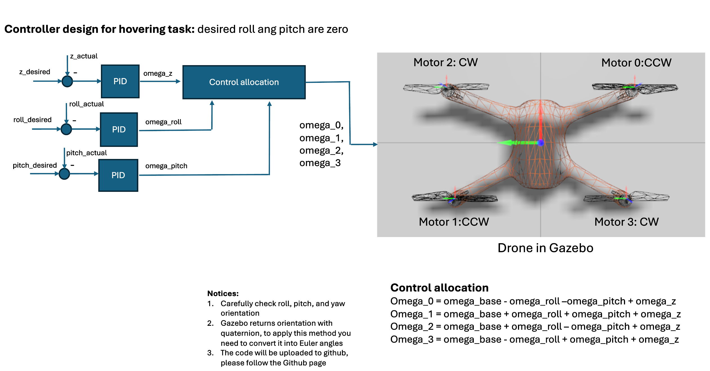
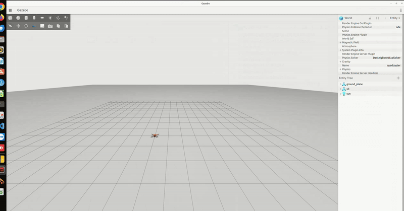
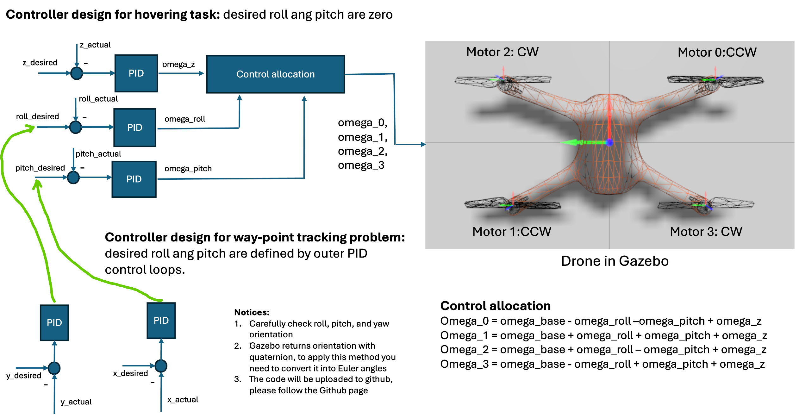
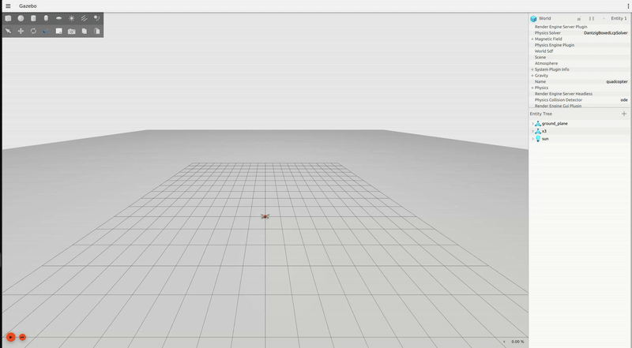

# 🤖 ROS-Gazebo Implementation: Nonlinear Control Design

This sub-repository provides an initial implementation for students participating in "Nonlinear Control of Autonomous and Robotic Systems."

## 🗂️ Repository Structure

```bash
drone_navigation/
├── launch/ 
├── models/
├── docs/
├── package.xml
├── CMakeList.txt
└── README.md
```
## Getting started
1. Install Ubuntu 22.04 or 24.04
2. Install ROS2: Humble (Ubuntu 22.04) or Jazzy (Ubuntu 24.04)
3. Install Gazebo
## We are now here to use this implementation
1. Create a custom ROS2 package:
   ```bash
   ## Create your working directory:
   mkdir -p /<your_preference_name>/src
   ## Navigate to your working directory:
   cd ..
   ## Now you are in /<your_preference_name> folder and you can build the package
   ros2 pkg create --build-type ament_python <your_package_name>
   ```
2. Download launch and models to <your_working_directory>/src/<your_package_name>
   ```bash
   # You can download it directly
   ```
3. Modify CMakeList.txt and package.xml accordingly

## An alternative, you can clone the repo 
   ```bash
   # Clone the repo to your working directory /src
   git clone git@github.com:vhdang-upb-acgroup/drone_navigation.git
   ```
## Build and run the launch file
   1. navigate to /<your working directory> such as ros2_ws, etc
   2. Run colcon build
   ```bash
      # Option 1: Build all packages which are located in /src
      colcon build
      # Option 2: Build only specific package
      colcon build --packages-select <package_name>
   ```
# Remember to source after building the package
   ```bash
      # source to get update by
      source install/setup.bash
   ```
# Now try to run the launch file to see
   ```bash
      # Run launch file with ROS2
      # ros2 launch <name_of_your_package> <name of your launch file>
      # For example:
      ros2 launch drone_navigation drone_nav.launch.py
   ```
# If everything works, you can observe


## Exercise 1: Check control inputs and feedback pose
In order to design a feedback control system, it is important to understand how the drone is controlled and which information is available.

# Control signals:
   For this drone system, we can control it via RPMs of four motors. 

# Feedback signals:
   We can access to the drone's pose which contains positions: (x, y, z) and orientation: (x, y, z, w) in quaternion.

## Exercise 2: Creat a ROS2 package to implement controller node
To do so, you should create another ROS2 package and you can name it "drone_controller"
1. To create a ROS2 package you can do as follows
   ```bash
      # Create an empty ROS2 package with python
      # Navigate to <your working directory>/src folder and run
      ros2 pkg create --build-type ament_python drone_controller
      # Build this package: You need to navigate to your working directory
      cd ..
      # Option 1: Build all packages inside /src with colcon build
      colcon build
      # Option2: Build only drone controller package with
      colcon build --packages-select drone_controller
   ```
2. Create a python file to implement your sensor_node that reads the pose of the drone
   ```bash
      ## You need to navigate to src/drone_controller/drone_controller
      # Option 1: using VSCode to create a python file called: sensor.py
      # Option 2: using touch sensor.py
      touch sensor.py
   ```
3. Start writing your implementation of reading the pose of the drone
   ```bash
      import rclpy
      from rclpy.node import Node
      from geometry_msgs.msg import PoseArray

      class PoseListener(Node):
         def __init__(self):
            super().__init__('pose_listener')
            self.subscription = self.create_subscription(
                  PoseArray,
                  '/world/quadcopter/pose/info',
                  self.pose_callback,
                  10)

         def pose_callback(self, msg: PoseArray):
            if len(msg.poses) > 1:
                  pose = msg.poses[1]  # Second pose
                  self.get_logger().info(
                     f"Second Pose: Position({pose.position.x:.2f}, {pose.position.y:.2f}, {pose.position.z:.2f}) "
                     f"Orientation({pose.orientation.x:.2f}, {pose.orientation.y:.2f}, "
                     f"{pose.orientation.z:.2f}, {pose.orientation.w:.2f})"
                  )
            else:
                  self.get_logger().warn("Received PoseArray with fewer than 2 poses")

      def main(args=None):
         rclpy.init(args=args)
         node = PoseListener()
         rclpy.spin(node)
         node.destroy_node()
         rclpy.shutdown()

      if __name__ == '__main__':
         main()
   ```
4. Update dependencies and console
   4.1 Update dependencies: Update the package.xml
   ```bash
      <!-- Build dependencies -->
      <build_depend>ros_gz_bridge</build_depend>
      <build_depend>rclcpp</build_depend>
      <build_depend>rclpy</build_depend>
      <build_depend>std_msgs</build_depend>
      <build_depend>geometry_msgs</build_depend>

      <!-- Runtime dependencies -->
      <exec_depend>ros_gz_bridge</exec_depend>
      <exec_depend>rclcpp</exec_depend>
      <exec_depend>rclpy</exec_depend>
      <exec_depend>std_msgs</exec_depend>
      <exec_depend>geometry_msgs</exec_depend>
   ```
   4.2 Update console: In setup.py you should add
   ```bash
      entry_points={
         'console_scripts': [
               "sensor_node = drone_controller.sensor:main",
         ],
      },
   ```
5. Build and run the node
   ```bash
      # Build the package
      colcon build --packages-select drone_controller
      # Make sure you source before you run the node
      source install/setup.bash
      # Run it
      ros2 run drone_controller sensor_node
   ```
## Exercise 3: Let's write control_command.py to send RPMs to control gz drone
All you need to do is that
1. You create a control_commands.py within src/drone_controller/drone_controller and the implementation looks like codes below
   ```bash
      import rclpy
      from rclpy.node import Node
      from actuator_msgs.msg import Actuators  # Make sure this matches your message package
      from std_msgs.msg import Header
      import time

      class MotorCommandPublisher(Node):
         def __init__(self):
            super().__init__('motor_command_publisher')
            self.publisher_ = self.create_publisher(Actuators, '/X3/gazebo/command/motor_speed', 10)
            self.timer = self.create_timer(0.1, self.timer_callback)

         def timer_callback(self):
            msg = Actuators()
            msg.header = Header()
            msg.header.stamp = self.get_clock().now().to_msg()

            # Set motor velocities (rad/s), adjust as needed
            msg.velocity = [500.0, 500.0, 500.0, 500.0]

            # Optional: clear other fields
            msg.position = []
            msg.normalized = []

            self.publisher_.publish(msg)
            self.get_logger().info(f'Published motor velocities: {msg.velocity}')

      def main(args=None):
         rclpy.init(args=args)
         node = MotorCommandPublisher()
         rclpy.spin(node)
         node.destroy_node()
         rclpy.shutdown()

      if __name__ == '__main__':
         main()
   ```
2. Update dependencies and console
   In setup.py add
   ```bash
      "control_node = drone_controller.control_commands:main",
   ```
3. Rebuild, source and run it again

## Exercise 4: Design a simple PID controller to maintain a certain height
1. Create a pid_z_controller.py within src/drone_controller/drone_controller
2. Implementation of pid z controller looks like codes below
```bash
   import rclpy
   from rclpy.node import Node
   from geometry_msgs.msg import PoseArray
   from actuator_msgs.msg import Actuators
   from std_msgs.msg import Header
   import time

   class HeightController(Node):
      def __init__(self):
         super().__init__('height_controller')

         # Target height in meters
         self.target_height = 2.0

         # PID gains
         self.Kp = 150.0
         self.Ki = 0.0
         self.Kd = 50.0

         # PID variables
         self.integral = 0.0
         self.last_error = 0.0
         self.last_time = self.get_clock().now()

         # ROS 2 interfaces
         self.subscription = self.create_subscription(
               PoseArray,
               '/world/quadcopter/pose/info',
               self.pose_callback,
               10)

         self.publisher_ = self.create_publisher(Actuators, '/X3/gazebo/command/motor_speed', 10)

      def pose_callback(self, msg: PoseArray):
         if len(msg.poses) <= 1:
               self.get_logger().warn("PoseArray has fewer than 2 poses")
               return

         current_height = msg.poses[1].position.z
         error = self.target_height - current_height

         now = self.get_clock().now()
         dt = (now - self.last_time).nanoseconds / 1e9  # Convert to seconds

         if dt == 0:
               return

         self.integral += error * dt
         derivative = (error - self.last_error) / dt

         # PID formula
         output = self.Kp * error + self.Ki * self.integral + self.Kd * derivative

         # Motor command limits
         base_speed = 400.0  # rad/s (hover baseline, adjust for your model)
         motor_speed = base_speed + output
         motor_speed = max(0.0, min(motor_speed, 900.0))  # limit between 0 and 900 rad/s

         # Apply to all 4 motors
         cmd = Actuators()
         cmd.header = Header()
         cmd.header.stamp = now.to_msg()
         cmd.velocity = [motor_speed] * 4
         cmd.position = []
         cmd.normalized = []

         self.publisher_.publish(cmd)
         self.get_logger().info(f"Height: {current_height:.2f} m | Command: {motor_speed:.2f} rad/s")

         self.last_error = error
         self.last_time = now

   def main(args=None):
      rclpy.init(args=args)
      node = HeightController()
      rclpy.spin(node)
      node.destroy_node()
      rclpy.shutdown()

   if __name__ == '__main__':
      main()
```
2. Update dependencies and console
3. Rebuild, source and run it

## If everything works, you can observe

# Issue of the current implementation
We just considers controlling the uav's height (z) and ignores attitude control. Consequently, the drone cannot maintain its height after a few seconds.

## Fix the issue to make our drone can really hover at a certain height.
We need to consider the attitude control as an inner loop. Therefore, we can just simply design two other PID controller that ensures the roll and pitch angles are always zeros.
1. Let review our drone coordinates

2. Design the hovering control system

3. Implement the control system in drone_controller package
```bash
   # PLEASE MAKE SURE YOU HAVE YOUR OWN ROS2 PACKAGE, e.g., I have drone_controller package, and I now can add a node inside it
   # Navigate to your local working directory, then /src/drone_controller
   # Create a python file, called pid_z_controller_update.py
   import rclpy
   from rclpy.node import Node
   from geometry_msgs.msg import PoseArray
   from actuator_msgs.msg import Actuators
   from std_msgs.msg import Header
   import numpy as np
   from scipy.spatial.transform import Rotation as R

   def quaternion_to_euler_scipy(w, x, y, z):
      # Reorder to [x, y, z, w] for scipy
      r = R.from_quat([x, y, z, w])
      return r.as_euler('xyz', degrees=True)  # Roll, pitch, yaw in degree
   def clamp(val, min_val, max_val):
      return max(min(val, max_val), min_val)


   class HoverController(Node):
      def __init__(self):
         super().__init__('hover_controller')

         # Memories for integral, last error, and integral limit
         self.integral_z = 0.0
         self.last_error_z = 0.0
         self.integral_limit_z = 50.0


         self.integral_y = 0.0
         self.last_error_y = 0.0
         self.integral_limit_y = 50.0

         self.integral_x = 0.0
         self.last_error_x = 0.0
         self.integral_limit_x = 50.0

         ###########################
         self.integral_roll = 0.0
         self.last_error_roll = 0.0
         self.integral_limit_roll = 50.0

         self.integral_pitch = 0.0
         self.last_error_pitch = 0.0
         self.integral_limit_pitch = 50.0


         # Declare last_time as current time, current x, y and z
         self.last_time = self.get_clock().now()
         self.current_z = None
         self.current_x = None
         self.current_y = None

         self.roll = None
         self.pitch = None
         self.yaw = None

         self.subscription = self.create_subscription(
               PoseArray,
               '/world/quadcopter/pose/info',
               self.pose_callback,
               10)

         self.publisher_ = self.create_publisher(
               Actuators,
               '/X3/gazebo/command/motor_speed',
               10)

      def pose_callback(self, msg: PoseArray):
         if len(msg.poses) <= 1:
               self.get_logger().warn("PoseArray has fewer than 2 poses")
               return
         self.current_z = msg.poses[1].position.z
         self.current_y = msg.poses[1].position.y
         self.current_x = msg.poses[1].position.x
         self.roll, self.pitch, self.yaw = quaternion_to_euler_scipy(
               msg.poses[1].orientation.w,
               msg.poses[1].orientation.x,
               msg.poses[1].orientation.y,
               msg.poses[1].orientation.z
         )
         self.control_loop()

      def control_loop(self):
         if self.current_z is None:
               self.integral_z = 0.0
               self.integral_roll = 0.0
               self.integral_pitch = 0.0
               self.last_time = self.get_clock().now()
               return

         now = self.get_clock().now()
         dt = (now - self.last_time).nanoseconds / 1e9
         if dt <= 0.001:
               return

         '''
               Define PID controller for z level control
               Step 1: Calculate error_z = z_d - current_z
               Step 2: Calculate omega_z based on PID controller
               Step 3: Add it to the base angular velocity
         '''
         omega_z, self.integral_z, self.last_error_z = pid_controller(2.0, self.current_z, self.last_error_z,self.integral_z, dt, 80, 1.0, 50)
         
         '''
               Make sure roll and pitch angles are zero
         '''
         omega_roll, self.integral_roll, self.last_error_roll = pid_controller(0.0, self.roll, self.last_error_roll,self.integral_roll, dt, 0.1, 0.0, 1)
         omega_pitch, self.integral_pitch, self.last_error_pitch = pid_controller(0.0, self.pitch, self.last_error_pitch,self.integral_pitch, dt, 0.1, 0.0, 1)
         
         self.integral_z = clamp(self.integral_z, -15.0, 15.0)
         self.integral_roll = clamp(self.integral_roll, -1.0, 1.0)
         self.integral_pitch = clamp(self.integral_pitch, -1.0, 1.0)
         # Motor speeds:
         motor0 = clamp(636.0 - omega_roll - omega_pitch + omega_z, 400.0, 800.0)
         motor1 = clamp(636.0 + omega_roll + omega_pitch + omega_z, 400.0, 800.0)
         motor2 = clamp(636.0 + omega_roll - omega_pitch + omega_z, 400.0, 800.0)
         motor3 = clamp(636.0 - omega_roll + omega_pitch + omega_z, 400.0, 800.0)


         cmd = Actuators()
         cmd.header = Header()
         cmd.header.stamp = now.to_msg()
         cmd.velocity = [motor0, motor1, motor2, motor3]

         self.publisher_.publish(cmd)
         self.last_time = now
         self.get_logger().info(f"Height: {self.current_z:.2f} m | Command: {motor0:.2f}, {motor1:.2f}, {motor2:.2f}, {motor3:.2f} rad/s || roll: {self.roll:.2f} | pitch: {self.pitch:.2f}")
         

   def pid_controller(set_point, actual, last_error, last_integral, dt, kp, ki, kd):
         error = set_point-actual
         integral = last_integral + error * dt
         derivative = (error - last_error) / dt

         return kp * error + ki * integral + kd * derivative, integral, error


   def main(args=None):
      rclpy.init(args=args)
      node = HoverController()
      rclpy.spin(node)
      node.destroy_node()
      rclpy.shutdown()


   if __name__ == '__main__':
      main()

```
# Test our pid_z_controller_update.py
1. using colcon build the drone_controller package
```bash
   colcon build --packages-select drone_controller
```
2. Remember to source before run the node
```bash
   source install/setup.bash
   ros2 run drone_controller <node name you specify in setup.py>
```
# The result will be like this


## Exercise 5: Design a control system that allows the drone performs way-point tracking
1. First we need to design a control system scheme that need to consider both attitude and altitude control loops. The control scheme should look like this

2. Then you create another python node inside drone_controller package
```bash
   # You should navigate to drone_controller/drone_controller
   # Create a python file, named pid_pos_controller.py
   # I recommend you to implement it by yourself at first. You can consider my implementation as below
import rclpy
from rclpy.node import Node
from geometry_msgs.msg import PoseArray
from actuator_msgs.msg import Actuators
from std_msgs.msg import Header
import numpy as np
from scipy.spatial.transform import Rotation as R

def quaternion_to_euler_scipy(w, x, y, z):
    # Reorder to [x, y, z, w] for scipy
    r = R.from_quat([x, y, z, w])
    return r.as_euler('xyz', degrees=True)  # Roll, pitch, yaw in degree
def clamp(val, min_val, max_val):
    return max(min(val, max_val), min_val)


class HoverController(Node):
    def __init__(self):
        super().__init__('hover_controller')

        # Memories for integral, last error, and integral limit
        self.integral_z = 0.0
        self.last_error_z = 0.0
        self.integral_limit_z = 50.0


        self.integral_y = 0.0
        self.last_error_y = 0.0
        self.integral_limit_y = 50.0

        self.integral_x = 0.0
        self.last_error_x = 0.0
        self.integral_limit_x = 50.0

        ###########################
        self.integral_roll = 0.0
        self.last_error_roll = 0.0
        self.integral_limit_roll = 50.0

        self.integral_pitch = 0.0
        self.last_error_pitch = 0.0
        self.integral_limit_pitch = 50.0


        # Declare last_time as current time, current x, y and z
        self.last_time = self.get_clock().now()
        self.current_z = None
        self.current_x = None
        self.current_y = None

        self.roll = None
        self.pitch = None
        self.yaw = None

        self.subscription = self.create_subscription(
            PoseArray,
            '/world/quadcopter/pose/info',
            self.pose_callback,
            10)

        self.publisher_ = self.create_publisher(
            Actuators,
            '/X3/gazebo/command/motor_speed',
            10)

    def pose_callback(self, msg: PoseArray):
        if len(msg.poses) <= 1:
            self.get_logger().warn("PoseArray has fewer than 2 poses")
            return
        self.current_z = msg.poses[1].position.z
        self.current_y = msg.poses[1].position.y
        self.current_x = msg.poses[1].position.x
        self.roll, self.pitch, self.yaw = quaternion_to_euler_scipy(
            msg.poses[1].orientation.w,
            msg.poses[1].orientation.x,
            msg.poses[1].orientation.y,
            msg.poses[1].orientation.z
        )
        self.control_loop()

    def control_loop(self):
        if self.current_z is None:
            self.integral_z = 0.0
            self.integral_roll = 0.0
            self.integral_pitch = 0.0
            self.last_time = self.get_clock().now()
            return

        now = self.get_clock().now()
        dt = (now - self.last_time).nanoseconds / 1e9
        if dt <= 0.001:
            return

        '''
            PID controller for altitude control loop
        '''
        omega_z, self.integral_z, self.last_error_z = pid_controller(5.0, self.current_z, self.last_error_z,self.integral_z, dt, 80, 1.0, 50)

        '''
            Design PID controllers for x, y tracking.
            Note that outputs of these controller are desired roll and pitch angles that are handled by attitude control loop
        '''
        desired_roll, self.integral_y, self.last_error_y = pid_controller(4.0, self.current_y, self.last_error_y,self.integral_y, dt, 80, 1.0, 50)
        desired_roll = clamp(desired_roll, -5, 5)
        desired_pitch, self.integral_x, self.last_error_x = pid_controller(4.0, self.current_x, self.last_error_x,self.integral_x, dt, 80, 1.0, 50)
        desired_pitch = clamp(desired_pitch, -5, 5)
        '''
            This is attitude control loop
        '''
        omega_roll, self.integral_roll, self.last_error_roll = pid_controller(-desired_roll, self.roll, self.last_error_roll,self.integral_roll, dt, 0.1, 0.0, 1)
        omega_pitch, self.integral_pitch, self.last_error_pitch = pid_controller(desired_pitch, self.pitch, self.last_error_pitch,self.integral_pitch, dt, 0.1, 0.0, 1)
        
        self.integral_z = clamp(self.integral_z, -15.0, 15.0)
        self.integral_roll = clamp(self.integral_roll, -10.0, 10.0)
        self.integral_pitch = clamp(self.integral_pitch, -10.0, 10.0)
        # Motor speeds:
        motor0 = clamp(636.0 - omega_roll - omega_pitch + omega_z, 400.0, 800.0)
        motor1 = clamp(636.0 + omega_roll + omega_pitch + omega_z, 400.0, 800.0)
        motor2 = clamp(636.0 + omega_roll - omega_pitch + omega_z, 400.0, 800.0)
        motor3 = clamp(636.0 - omega_roll + omega_pitch + omega_z, 400.0, 800.0)


        cmd = Actuators()
        cmd.header = Header()
        cmd.header.stamp = now.to_msg()
        cmd.velocity = [motor0, motor1, motor2, motor3]


        self.publisher_.publish(cmd)
        self.last_time = now
        self.get_logger().info(f"x, y, z: {self.current_x:.2f}, {self.current_y:.2f}, {self.current_z:.2f} m | Desired roll, pitch angles: {desired_roll:.2f}, {desired_pitch:.2f}| Command: {motor0:.2f}, {motor1:.2f}, {motor2:.2f}, {motor3:.2f} rad/s || roll: {self.roll:.2f} | pitch: {self.pitch:.2f}")
        

def pid_controller(set_point, actual, last_error, last_integral, dt, kp, ki, kd):
        error = set_point-actual
        integral = last_integral + error * dt
        derivative = (error - last_error) / dt

        return kp * error + ki * integral + kd * derivative, integral, error


def main(args=None):
    rclpy.init(args=args)
    node = HoverController()
    rclpy.spin(node)
    node.destroy_node()
    rclpy.shutdown()


if __name__ == '__main__':
    main()
```
# Test your pid_pos_controller.py
1. using colcon build the drone_controller package
```bash
   colcon build --packages-select drone_controller
```
2. Remember to source before run the node
```bash
   source install/setup.bash
   ros2 run drone_controller <node name you specify in setup.py>
```
# The result will be like this


## Exercise 6: Make something more interesting: eight-figure trajectory?
1. All you need to do is to define your own trajectory function for which the drone need to tracking
```bash
   def figure8_trajectory(t, A=1.0, B=1.0, omega=1.0, z=1.0):
      """
      Generate desired x, y, z positions following a figure-eight trajectory.
      
      Args:
         t (float): time or trajectory parameter
         A (float): amplitude in x direction
         B (float): amplitude in y direction
         omega (float): angular frequency (controls speed)
         z (float): constant altitude
         
      Returns:
         (x, y, z): desired position tuple
      """
      x = A * math.sin(omega * t)
      y = B * math.sin(omega * t) * math.cos(omega * t)
      return x, y, z
```
2. Can you design and implement more acrobatic trajectory? Now is your time

