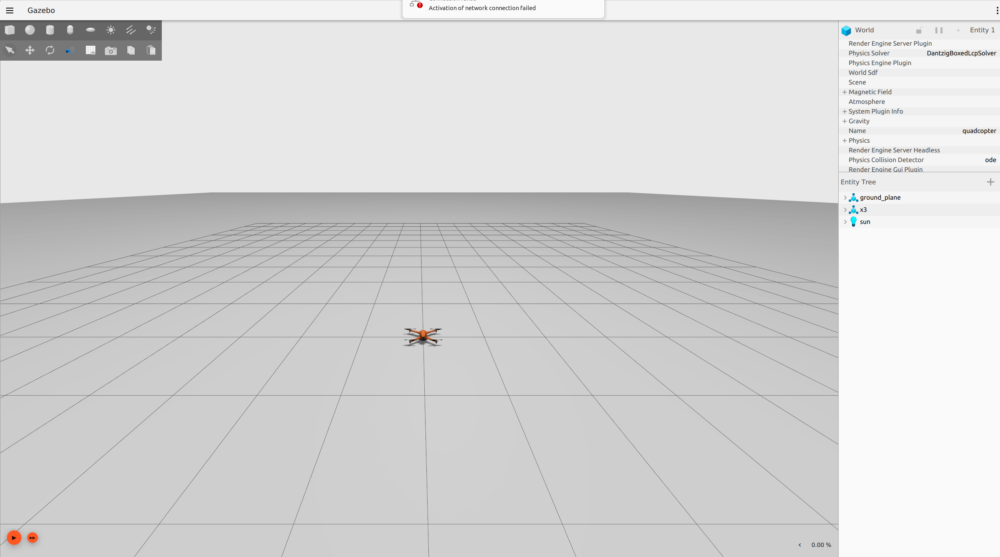

# 🤖 ROS-Gazebo Implementation: Nonlinear Control Design

This sub-repository provides an initial implementation for students participating in "Nonlinear Control of Autonomous and Robotic Systems."

## 🗂️ Repository Structure

```bash
drone_navigation/
├── launch/ 
├── models/
├── docs/
├── package.xml
├── CMakeList.txt
└── README.md
```
## Getting started
1. Install Ubuntu 22.04 or 24.04
2. Install ROS2: Humble (Ubuntu 22.04) or Jazzy (Ubuntu 24.04)
3. Install Gazebo
## We are now here to use this implementation
1. Create a custom ROS2 package:
   ```bash
   ## Create your working directory:
   mkdir -p /<your_preference_name>/src
   ## Navigate to your working directory:
   cd ..
   ## Now you are in /<your_preference_name> folder and you can build the package
   ros2 pkg create --build-type ament_python <your_package_name>
   ```
2. Download launch and models to <your_working_directory>/src/<your_package_name>
   ```bash
   # You can download it directly
   ```
3. Modify CMakeList.txt and package.xml accordingly

## An alternative, you can clone the repo 
   ```bash
   # Clone the repo to your working directory /src
   git clone git@github.com:vhdang-upb-acgroup/drone_navigation.git
   ```
## Build and run the launch file
   1. navigate to /<your working directory> such as ros2_ws, etc
   2. Run colcon build
   ```bash
      # Option 1: Build all packages which are located in /src
      colcon build
      # Option 2: Build only specific package
      colcon build --packages-select <package_name>
   ```
# Remember to source after building the package
   ```bash
      # source to get update by
      source install/setup.bash
   ```
# Now try to run the launch file to see
   ```bash
      # Run launch file with ROS2
      # ros2 launch <name_of_your_package> <name of your launch file>
      # For example:
      ros2 launch drone_navigation drone_nav.launch.py
   ```
# If everything works, you can observe


## Exercise 1: Check control inputs and feedback pose
In order to design a feedback control system, it is important to understand how the drone is controlled and which information is available.

# Control signals:
   For this drone system, we can control it via RPMs of four motors. 

# Feedback signals:
   We can access to the drone's pose which contains positions: (x, y, z) and orientation: (x, y, z, w) in quaternion.

## Exercise 2: Design a simple P or PI controller for hovering task
To do so, you should create another ROS2 package and you can name it "drone_controller"
1. To create a ROS2 package you can do as follows
   ```bash
      # Create an empty ROS2 package with python
      # Navigate to <your working directory>/src folder and run
      ros2 pkg create --build-type ament_python drone_controller
      # Build this package: You need to navigate to your working directory
      cd ..
      # Option 1: Build all packages inside /src with colcon build
      colcon build
      # Option2: Build only drone controller package with
      colcon build --packages-select drone_controller
   ```
2. Create a python file to implement your PID controller
   ```bash
      ## You need to navigate to src/drone_controller/drone_controller
      # Option 1: using VSCode to create a python file called: pid_hovering.py
      # Option 2: using touch pid_hovering.py
      touch pid_hovering.py
   ```
3. Start writing your implementation of PID controller that set a certain height (z position) and read feedback from pose


